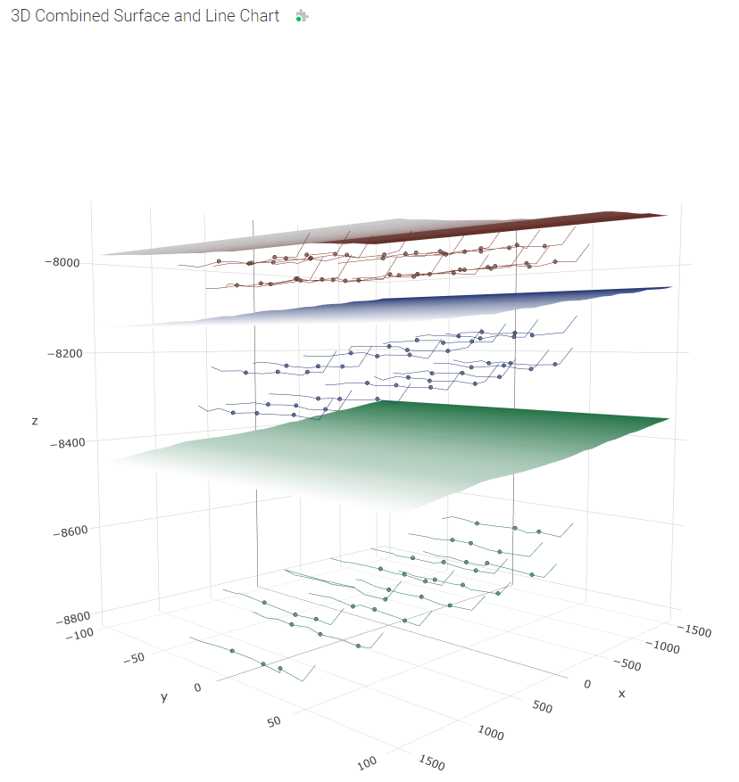
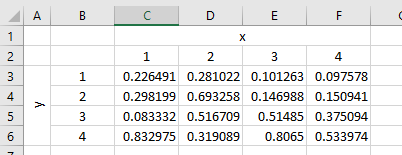
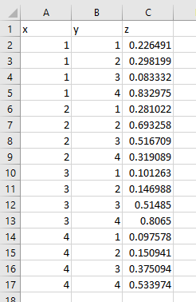
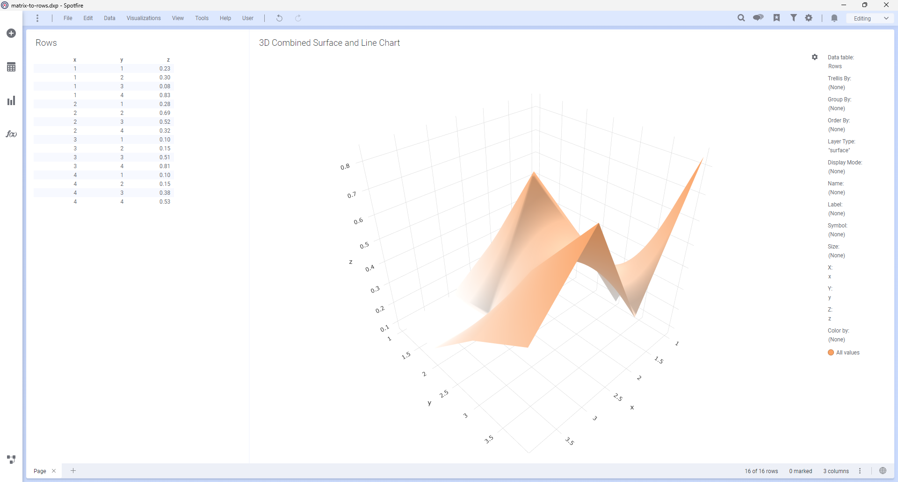
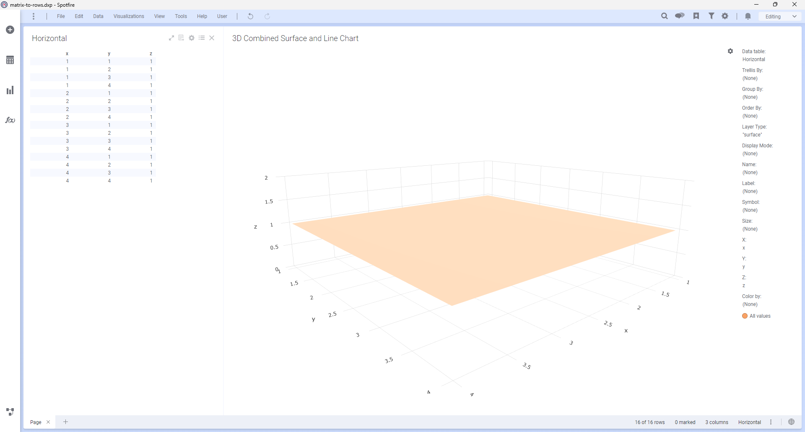
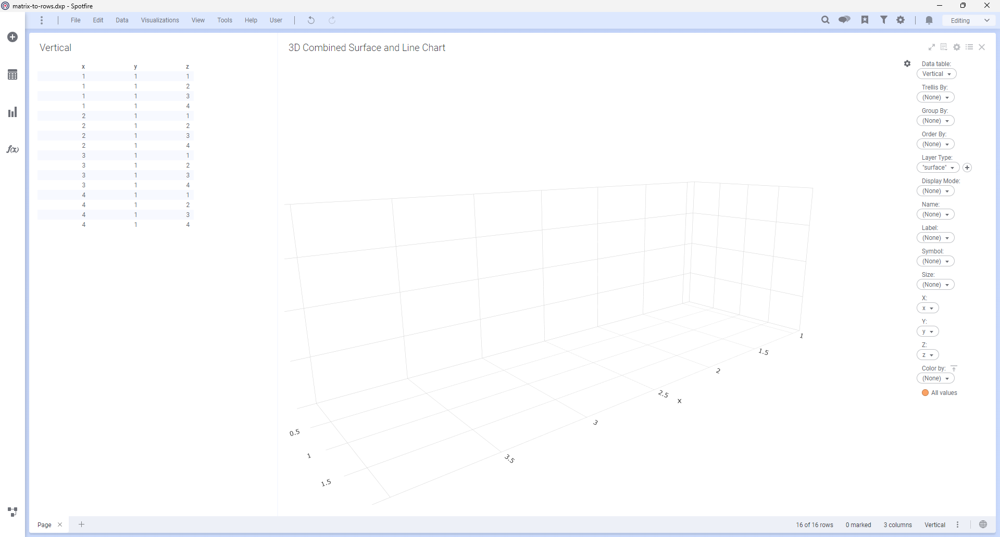
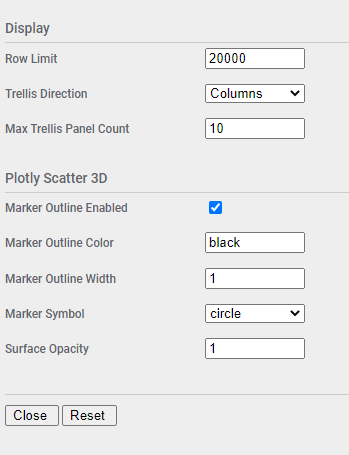

# 3D Combined Surface and Line Chart Mod for Spotfire®

The 3D Combined Surface and Line Chart Mod is used to draw 3D representations of various structures. It has applicability in the oil & gas industry to help visualize formations and wellbore trajectories in three dimensions. It helps in planning drilling and completions activities.



## Try this mod in Spotfire® Analyst

### How to open the mod
1. Open Spotfire® Analyst, and create an analysis by loading some data.
1. Unzip the downloaded file, and locate the .mod file in the unzipped folder. 
1. Drag the file into the analysis. 
1. The visualization mod is added to the analysis.
1. To learn about the capabilities and limitations of this visualization mod, keep reading.

For general information on how to use and share visualization mods, [read the Spotfire documentation](https://docs.tibco.com/pub/sfire-analyst/latest/doc/html/en-US/TIB_sfire-analyst_UsersGuide/index.htm#t=modvis%2Fmodvis_how_to_use_a_visualization_mod.htm).

## Data requirements

Every mod handles missing, corrupted and/or inconsistent data in different ways. It is advised to always review how the data is visualized.

The 3D Combined Surface and Line Chart Mod will draw surfaces, lines, and points in a three dimensional space. To do this, spatial data must be provided and pre-computed where necessary. 

Lines and points will generally plot with specified x, y, z co-ordinates as expected. But there are special requirements for surface data, due to contraints in the underlying Plotly library.

### Surface Data Requirements

When surface data is provided, it will be transformed from x, y, z rows into a 2-dimensional matrix for plotting. In order for the surface to display, there should not be any gaps or nulls in the matrix. This means that for every possible combination of x and y, there should be a z value. This constraint applies to co-ordinates within a given Group By value, which results in a single surface instance.

This image shows a simple 4X4 matrix, with x values across the top, and y values along the left-hand side:



Note that there are no empty cells here. 

This matrix will need to be converted to 16 rows (4 X 4 = 16), with x, y, z co-ordinates and will look like this:



Once in rows format, that data can be imported into Spotfire® and used with the Mod.



In some circumstances a partial surface will be generated when there are gaps in the data, but it has been observed that in other cases no surface at all is displayed, and no error is produced. So this must be considered when building datasets and configuring the Mod.

It has also been observed that Plotly will sometimes not plot perfectly flat planes. For example, this horizontal plane was plotted correctly:



But this vertical plane results in no surface:



One possible workaround for this is to apply a very small delta to the y-values in alternating rows, but this could also impact the automatic scales, resulting in an inclined plane rather than a vertical plane where the axis range is particularly small.

## Setting up the 3D Combined Surface and Line Chart

The Mod includes the following axes. Not all axis values are mandatory and this will be indicated.

### Trellis By

Optional. The Mod supports trellising with rows being grouped by the value in this axis. 

### Layer Type 

Mandatory. Must contain one of the following permitted values depending on row context.

* **surface** - identifies surface plot rows, linked together using Group By, and drawn as a 3-dimensional surface

* **scatter** - identifies scatter plot rows, and rendered using the value in **Display Mode**. For lines, the rows are linked together using Group By and drawn as a line. For markers this value is ignored.

Any other value will cause the row to be ignored.

### Display Mode

Mandatory for **scatter** Layer Type, ignored for **surface**. Must contain one of the following permitted values depending on row context.

* **lines** - links together rows using Group By, and drawn as a 3-dimensional line
* **markers** - Group By is ignored, and rows will be drawn as markers in 3-dimensional space

Any other value will cause the row to be ignored.

### Group By 

Mandatory for surface and scatter line rows. This value will group rows together to render as a single surface or line.

To configure grouping for a combination of surface, line, and marker rows it may be necessary to set the axis to an expression. For example:

```
Concatenate([layerType],"-",[displayMode],"-",[name])
```

### Order By

Optional for scatter line rows. No effect for all other rows. This ensures that lines are drawn with points in the correct order. This may not be necessary if points are delivered correctly by the underlying Mods API, but this cannot always be guaranteed. In this event, use this axis to correct any issues.

### Name 

Optional. Display name for rows when hovered with the mouse. 

### Label 

Optional. Additional label for rows when hovered with the mouse.

### Symbol

Optional for scatter marker rows. No effect on other rows. Defines what symbol will be drawn for markers. Must be one of the following values:

* **circle**
* **circle-open**
* **cross**
* **diamond**
* **diamond-open**
* **square**
* **square-open**
* **x**

If omitted then the marker will render as the default in the Mod configuration. If any other value is configured, then the marker will not render.

### Size 

Optional for scatter line and marker rows. No effect on surface rows. Defines the size for the marker or line. To set size independently for markers and lines an expression could be used, for example:

```
If([displayMode]="markers",50,10)
```

### X 

Mandatory. The x-axis position.

### Y 

Mandatory. The y-axis position.

### Z 

Mandatory. The z-axis position.

### Color 

Optional. Sets the color of the surface, line, or marker. It may be necessary to use an expression here depending on requirements. For example, to color lines and markers the same color as an associated surface, the following expression could be used:

```
If([layerType]="surface",[name],[reservoir])
```

## Configuring the 3D Combined Surface and Line Chart

Additional configuration for the mod can be accessed by clicking on the small settings icon in the upper right corner of the visualization area. This will display the configuration properties over the visualization. Maximize the visualization if necessary to update the fields. The configuration panel will only be accessible when the analysis is in Editing mode. 



| Property | Description | Remarks |
| -------- | ----------- | ------- |
| Row Limit | Maximum number of rows to render | If the row count is exceeded then an error message will be displayed. This is a safety feature to keep from accidentally rendering too much data. |
| Trellis Direction | Direction for trellis panels | Columns or Rows |
| Max Trellis Panel Count | Maximum number of trellis panels to render | If the panel count is exceeded then an error message will be displayed. This is a safety feature to keep from accidentally rendering too much data. |
| Marker Outline Enabled | Outline markers |  |
| Marker Outline Color | Maker outline color | This only has effect if Marker Outline Enabled is true. Must be a valid HTML color name. |
| Marker Outline Width | Maker outline width in px | This only has effect if Marker Outline Enabled is true. |
| Marker Symbol | Default marker symbol | Applies only if Symbol axis is not configured |
| Surface Opacity | Formation surface opacity | Must be a decimal number between 0.0 and 1.0 |

## Using the 3D Combined Surface and Line Chart

Once the mod is configured it will render a 3-dimensional chart of surfaces, lines, and markers, positioned according to the X, Y, and Z axis configuration.

### Marking
The mod supports marking of lines and markers. Surface marking will be ignored. Click a marker or line point to mark it. Use CTRL-Click to add additional rows to the marking, or remove an already marked row. To clear the marking, click in any open area. This mod does not support rectangular marking due to limitations of the underlying Plotly library.

## Building the Project

In a terminal window:
- `npm install`
- `npm start`

In a new terminal window:
- `npm run server`

## More information about Spotfire® Mods

- [Spotfire® Visualization Mods on the Spotfire® Community Exchange](https://community.spotfire.com/files/category/7-visualization-mods/): A safe and trusted place to discover ready-to-use Mods
- [Spotfire® Mods Developer Documentation](https://spotfiresoftware.github.io/spotfire-mods/docs/): Introduction and tutorials for Mods Developers
- [Mods by Spotfire®](https://github.com/spotfiresoftware/spotfire-mods/releases/latest): A public repository for example projects


© Copyright 2024. Cloud Software Group, Inc.